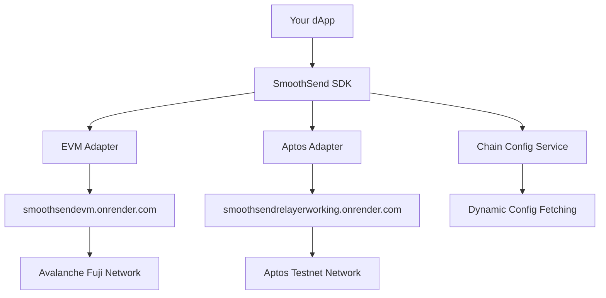

# SmoothSend SDK Documentation

A powerful multi-chain SDK for seamless gasless transaction integration in your dApps. Currently supporting **Avalanche Fuji testnet** and **Aptos testnet** with a unified developer experience and dynamic configuration system.

## Quick Start

```bash
npm install @smoothsend/sdk
```

### Avalanche Example
```typescript
import { SmoothSendSDK } from '@smoothsend/sdk';
import { ethers } from 'ethers';

// Initialize the SDK
const sdk = new SmoothSendSDK();

// Connect wallet
const provider = new ethers.BrowserProvider(window.ethereum);
const signer = await provider.getSigner();

// Execute Avalanche transfer
const result = await sdk.transfer({
  from: await signer.getAddress(),
  to: '0x742d35cc6634c0532925a3b8d2d2d2d2d2d2d2d3',
  token: 'USDC',
  amount: '1000000', // 1 USDC (6 decimals)
  chain: 'avalanche'
}, signer);

console.log('Transfer successful:', result.txHash);
```

### Aptos Example
```typescript
import { SmoothSendSDK } from '@smoothsend/sdk';

// Initialize the SDK
const sdk = new SmoothSendSDK();

// Execute Aptos transfer (with Aptos wallet)
const result = await sdk.transfer({
  from: '0x1234567890abcdef1234567890abcdef12345678',
  to: '0x8765432109fedcba8765432109fedcba87654321',
  token: 'USDC',
  amount: '1000000', // 1 USDC (6 decimals)
  chain: 'aptos-testnet'
}, aptosWallet);

console.log('Transfer successful:', result.txHash);
```

## What is SmoothSend?

SmoothSend SDK enables **gasless transactions** across multiple blockchains, allowing your users to interact with your dApp without holding native gas tokens. Users pay fees in stablecoins while the SDK handles the complexity of meta-transactions and relayer communication.

### Key Features

- 🚀 **Multi-Chain**: Supporting Avalanche Fuji and Aptos testnet
- 💸 **Gasless Transactions**: Users pay fees in tokens, not native gas
- 🛡️ **Type-Safe**: Full TypeScript support with comprehensive type definitions
- 📊 **Event System**: Real-time transaction status updates
- 🔄 **Unified API**: Consistent interface across all supported chains
- 📦 **Batch Transfers**: Execute multiple transfers in a single transaction (Avalanche)
- 🔌 **Wallet Integration**: Easy integration with popular wallets (MetaMask, Petra, etc.)
- ⚡ **Dynamic Configuration**: Chain configurations fetched dynamically from relayers

## Supported Chains

| Chain | Network | Status | Features |
|-------|---------|--------|----------|
| Avalanche | Fuji Testnet | ✅ Active | EIP-712 signatures, Batch transfers, USDC support |
| Aptos | Testnet | ✅ Active | Move-based contracts, Gasless transactions, USDC/APT support |

## Architecture Overview



## Next Steps

- [Installation Guide](./installation.md)
- [Quick Start Guide](./quick-start.md)
- [API Reference](./api/index.md)
- [Avalanche Guide](./chains/avalanche.md)
- [Aptos Guide](./chains/aptos.md)
- [Examples](./examples/index.md)
