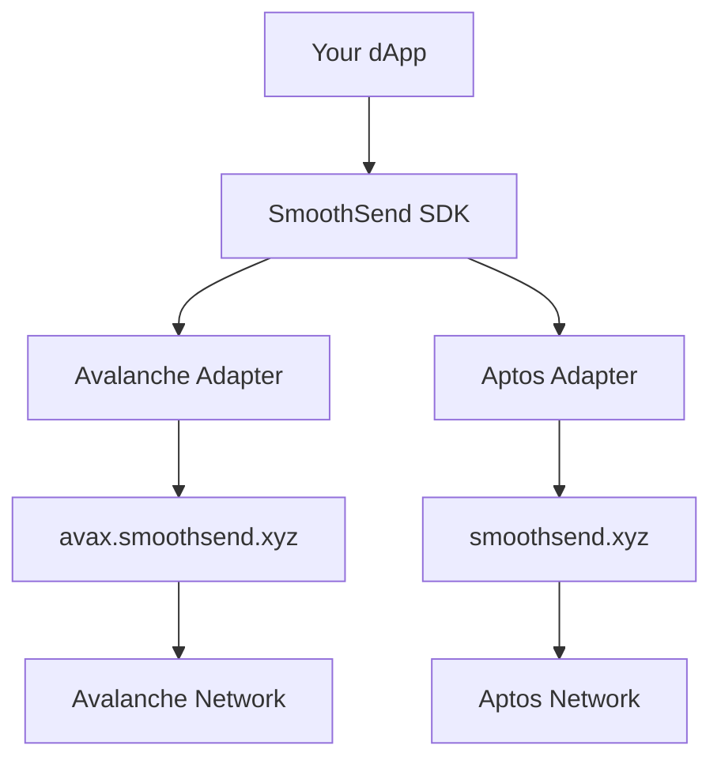

# SmoothSend SDK Documentation

A powerful multi-chain SDK for seamless gasless transaction integration in your dApps. Support for Avalanche and Aptos blockchains with unified developer experience.

## Quick Start

```bash
npm install @smoothsend/sdk
```

```typescript
import { SmoothSendSDK } from '@smoothsend/sdk';

// Initialize the SDK
const smoothSend = new SmoothSendSDK({
  timeout: 30000,
  retries: 3
});

// Create a transfer request
const transferRequest = {
  from: '0x742d35cc6634c0532925a3b8d2d2d2d2d2d2d2d2',
  to: '0x742d35cc6634c0532925a3b8d2d2d2d2d2d2d2d3',
  token: 'USDC',
  amount: '1000000', // 1 USDC (6 decimals)
  chain: 'avalanche' as const
};

// Execute transfer (with wallet signer)
try {
  const result = await smoothSend.transfer(transferRequest, walletSigner);
  console.log('Transfer successful:', result.txHash);
} catch (error) {
  console.error('Transfer failed:', error.message);
}
```

## What is SmoothSend?

SmoothSend SDK enables **gasless transactions** across multiple blockchains, allowing your users to interact with your dApp without holding native gas tokens. Users pay fees in stablecoins while the SDK handles the complexity of meta-transactions and relayer communication.

### Key Features

- 🚀 **Multi-Chain Support**: Seamlessly work with Avalanche and Aptos
- 💸 **Gasless Transactions**: Users pay fees in tokens, not native gas
- 🛡️ **Type-Safe**: Full TypeScript support with comprehensive type definitions
- 📊 **Event System**: Real-time transaction status updates
- 🔄 **Unified API**: Same interface across all supported chains
- 📦 **Batch Transfers**: Execute multiple transfers in a single transaction (Avalanche)
- 🔌 **Wallet Integration**: Easy integration with popular wallets

## Supported Chains

| Chain | Network | Status | Features |
|-------|---------|--------|----------|
| Avalanche | Fuji | ✅ Active | EIP-712 signatures, Batch transfers |
| Aptos | Testnet | ✅ Active | Native signatures, USDC fees |

## Architecture Overview



## Next Steps

- [Installation Guide](./installation.md)
- [API Reference](./api/index.md)
- [Chain Guides](./chains/avalanche)
- [Examples](./examples/index.md)
