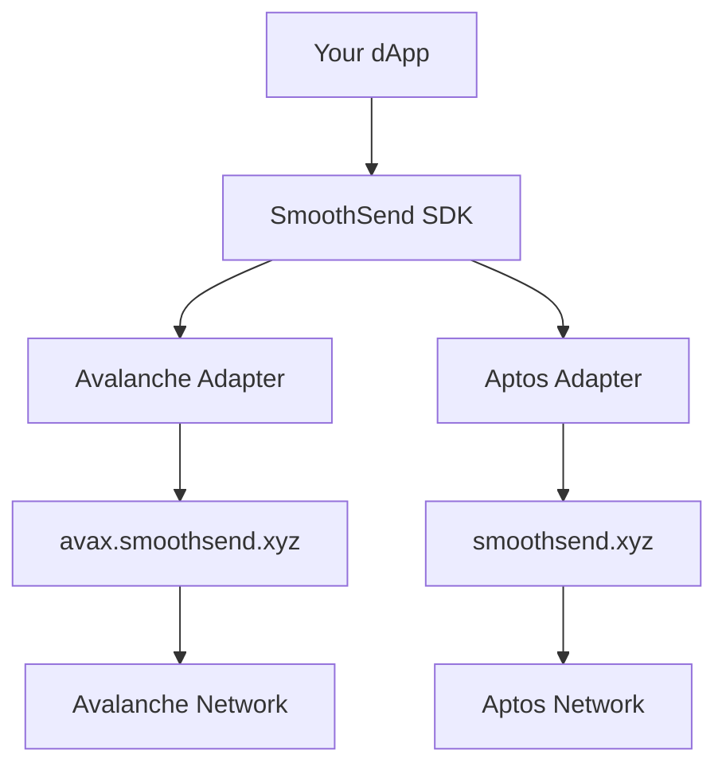

# SmoothSend SDK Documentation

The ultimate multi-chain gasless transaction SDK for seamless dApp integration.

## Quick Start

```bash
npm install @smoothsend/sdk
```

```javascript
import { SmoothSendSDK } from '@smoothsend/sdk';

const sdk = new SmoothSendSDK();
const chains = sdk.getSupportedChains(); // ['avalanche', 'aptos']
```

## What is SmoothSend?

SmoothSend SDK enables **gasless transactions** across multiple blockchains, allowing your users to interact with your dApp without holding native gas tokens. Users pay fees in stablecoins while the SDK handles the complexity of meta-transactions and relayer communication.

### Key Benefits

- 🚀 **Seamless UX**: Users don't need gas tokens
- 🔗 **Multi-Chain**: Avalanche and Aptos support
- 🛡️ **Type-Safe**: Full TypeScript support
- 🎯 **Production-Ready**: Comprehensive error handling
- 📊 **Event System**: Real-time transaction tracking

## Supported Chains

| Chain | Network | Status | Features |
|-------|---------|--------|----------|
| Avalanche | Mainnet/Fuji | ✅ Live | EIP-712, Batch transfers |
| Aptos | Mainnet/Testnet | ✅ Live | Native signing, USDC fees |

## Architecture Overview



## Next Steps

- [Installation Guide](./installation.md)
- [API Reference](./api/index.md)
- [Chain Guides](./chains/index.md)
- [Examples](./examples/index.md)
